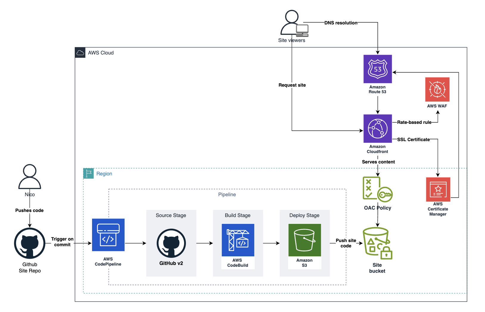

# Personal Site
Here's the code for my personal site/blog that I host at [https://nicorossi.net](https://nicorossi.net)

This project originated as an opportunity to experiment with the [Hugo](https://gohugo.io/) framework while also serving as a place to document my learnings throughout my software engineering journey. \
To streamline deployment and stay updated with the latest changes, I've implemented a CI/CD pipeline. This setup automates the deployment process by integrating our GitHub repository with AWS CodePipeline.
To avoid manual tinkering with the AWS console for site modifications, all essential resources are managed using Terraform Infrastructure as Code (IaC).

## Site Code
Under the `code` directory you'll find the source code for the site itself and follows the standard Hugo project structure.  
- The site is built using the [Doks](https://getdoks.org/) theme.
## Deployment
Under the `deploy` directory you'll find the Terraform code to manage the AWS resources needed to host the site.
The deployment process is automated using AWS CodePipeline and CodeBuild. The pipeline is triggered by changes to the `main` branch of this repository. The pipeline is defined in the `deploy` directory and is managed using Terraform.

Instead of the typical static website hosting setup on S3, I've opted for a CloudFront distribution with an S3 bucket as the origin. It's configured with Origin Access Control (OAC) to restrict access, eliminating the necessity to make the bucket public.  
### Pipeline and Automation
<figure style="max-width: 1204px; max-height: 659px;">
    
    <figcaption>System infrastructure diagram</figcaption>
</figure>