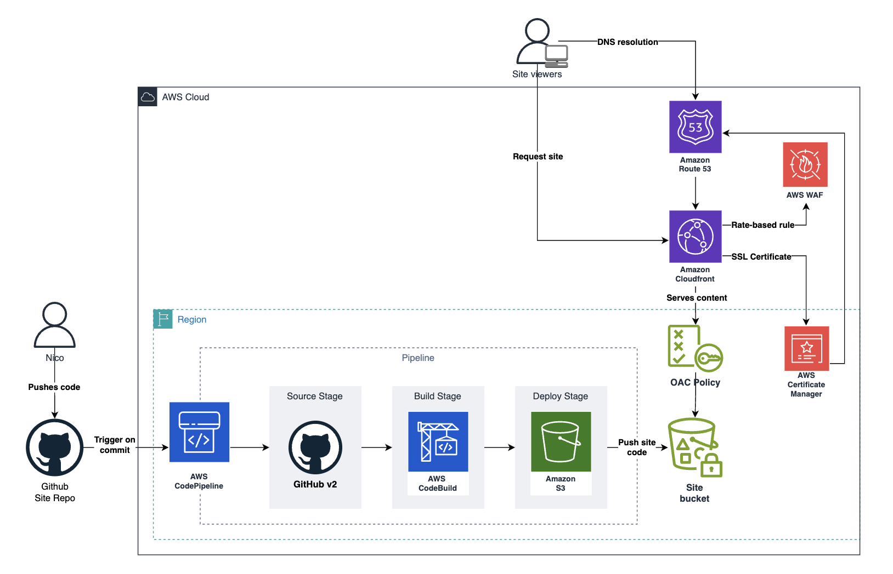

I've never blogged about anything before, so this is a totally new skill for me to master.
But like many other proud nerds, I usually find myself jumping from blog to blog, reading about various topics. 
Technology is changing our lives every day, so I thought I'd share a little bit of my journey with it.
With all that said, let's see what happens from here 🚀

## About this site
This project originated as an opportunity to experiment with the Hugo framework while also serving as a place
to document my learnings throughout my software engineering journey.

[Hugo](https://gohugo.io/) stands as a markdown, folder-based static site generator crafted to empower creators with
effortless website development. It's open-source, has a ton of themes to choose from, and it's super fast too.
After peaking through the themes available, I decided to go with [Doks](https://getdoks.org/). It looked very complete
so I figured it would be a good starting point to learn and build upon.

## Pipeline and Automation
Like any other good engineer, I try to aim for simplicity when it comes to maintaining things, and being AWS my
bread & butter at work, I decided to host, serve, and deploy the site using AWS.
But hey! who wants to spend all their time surfing the console just to make a tweak here and there, right?
So, I went with the best practice and managed all resources using Terraform Infrastructure as Code (IaC).
Keeps things nice and tidy 😌.
<figure>
    
    <figcaption>Pipeline and infrastructure diagram</figcaption>
</figure>
To streamline deployment and keep everything easily updated, I build all into a pipeline that
automates the deployment process. Hooked up to AWS CodePipeline and CodeBuild, the process is triggered
by changes to the main branch of the site repository. 
 
Check out the diagram up there❗ 
Instead of going with the usual static website hosting setup on S3, I decided to go for something a bit "fancier".
I've opted for a CloudFront distribution, and it's linked to an S3 bucket acting as the origin.
And here's the cool part - using Origin Access Control (OAC) to tighten up security there's no need to make
the bucket public.  

Source code can be found [here](https://github.com/nicrossi/blog).
Pipeline [here](https://github.com/nicrossi/blog/blob/main/buildspec.yml).

I might write more about the full detailed recipe for building a personal site in the future,
but for now, this is it.
