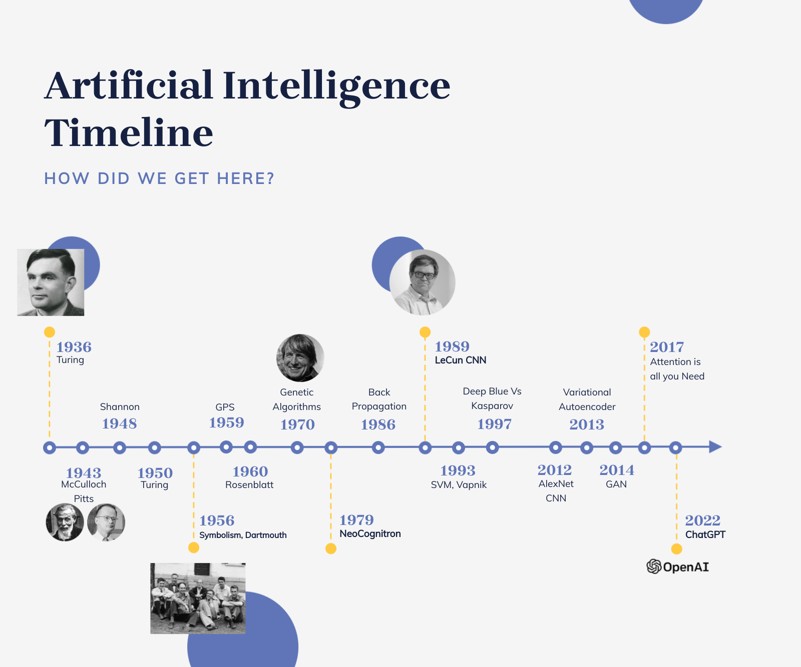

<figure>
    
    <figcaption>Artificial Intelligence, Timeline of important events.</figcaption>
</figure>

It’s key to look past the current hype and marketing. Whether it is the "thinking machines" of 1958 or the "AGI" claims
of today, the underlying reality is often the same. **Modern Artificial Intelligence is fundamentally mathematical
optimization running on powerful hardware (GPUs).** It is about adjusting parameters to minimize error and finding
patterns in data.

The revolution today is real, but it is driven by the convergence of algorithms, massive data, and hardware acceleration,
rather than the sudden emergence of a synthetic mind.
## The Elusive Definition of Intelligence
The field of Artificial Intelligence emerged from a fundamental paradox: the ambition to artificially recreate something
that we cannot fully or precisely define. Because attempts to define intelligence often become recursive (like
*"Intelligence is the ability to think intelligently"*), the discipline has historically adopted a pragmatic approach.
This pragmatism is most famous in the Turing Test, proposed by **Alan Turing in 1950**; rather than struggling with the
philosophical question "Can machines think?", Turing shifted the focus to **"Can machines act like they think?"**.
He proposed that if a human judge could not distinguish a machine from a human based on their interactions, the machine
could be considered intelligent. Note, this behavioral definition contrasts with the concept of "embodiment," which
argues that true intelligence may require a physical body. In this view, biological entities like cockroaches or humans
possess innate intelligence encoded in their physical structure (such as the biological mechanisms that enable walking)
which allows them to survive in ways that purely digital, disembodied intelligences cannot replicate.

## Symbolism vs. Connectionism
The history of AI is a tug-of-war between two different approaches to solving problems.
### Symbolism (The Logic Approach)
In the 1950s, the dominant belief was that intelligence consisted of the manipulation of symbols using inference logic,
an approach largely pioneered by researchers like **Newell and Simon**. The method relied on programmers explicitly coding
rules and logic, often utilizing decision trees where hypotheses were placed at the root and deductions followed in
branches. This led to the creation of the **"General Problem Solver" (GPS)**, with researchers operating under the assumption
that if a problem could be reduced to formal symbolic logic, a machine could solve virtually anything, ranging from
proving theorems in Principia Mathematica to addressing military problems of the Cold War.
However, while these systems were excellent at handling formal logic within restricted domains, they ultimately failed
to scale to the messy real world; they struggled significantly when faced with incomplete information, noisy data, or
concepts that rigid logical rules could not accommodate.
### Connectionism (The Biological Approach)
Running parallel to the symbolic approach was the concept of modeling the physical structure of the brain itself.
This effort began in 1943 when **Warren McCulloch and Walter Pitts** proposed the **first mathematical model of a neuron**
as a simple binary switch (outputting 0 or 1) and proved that structures of these neurons could theoretically compute
any computable function. However, the mechanism for determining these connections remained unclear until 1949, when
**Donald Hebb** introduced a biological rule for learning (*"neurons that fire together, wire together"*) which provided
a method for neural networks to "learn" by strengthening the connections between simultaneously active neurons.
Building on these principles, **Frank Rosenblatt constructed the Perceptron in 1958**, the first physical "biomimetic"
device designed to learn directly from experience rather than relying on pre-programmed logical rules.

### Summers, Winters, and Hype
The development of AI is characterized by cycles of extreme optimism, often called "summers", followed by periods of
disappointment and funding cuts known as "winters". This journey began in **1956 at the Dartmouth Summer Research Project**
where the term "Artificial Intelligence" was coined. This naming was essentially a marketing move by John McCarthy to
distinguish his work from Norbert Wiener's "Cybernetics" due to personal and academic rivalries, as McCarthy explicitly
wished to avoid association with Wiener. The proposal was incredibly ambitious, as it claimed that a small group of
scientists could solve major problems like language, abstraction, and creativity in just one summer.

Following this initial enthusiasm, early efforts like symbolic models and connectionist models such as the Perceptron
failed to scale when applied to large or complex problems. Researchers consistently blamed the hardware by arguing that
computers were simply too slow and had too little memory to execute their vision. History eventually proved them right
in what is often called the **"hardware lottery"**, which suggests that many breakthroughs we see today are simply older
algorithms that finally found hardware powerful enough, specifically modern processors and GPUs, to run effectively.

### The Rise of Machine Learning (1990s - 2000s)
As the hype around "thinking machines" subsided, a more rigorous and mathematical approach took over in the **1990s and
2000s** known as **Machine Learning**. Instead of trying to mimic brains biologically or strictly code logical rules,
ML focused on statistics and **defined learning as a process of optimization** where parameters are adjusted to fit data
distributions. During this period, algorithms like Support Vector Machines (SVM) became standard tools in the industry.

### Deep Learning (2012 - Present)
The current era, known as Deep Learning, began when researchers like Hinton, LeCun, and Bengio revived connectionism.
The catalyst was the **2012 ImageNet competition** where a neural network named **AlexNet** dominated the field, proving
that deep neural networks with many layers could outperform traditional methods given enough data and compute power.
Ultimately, Deep Learning represents old connectionist ideas winning the hardware lottery thanks to modern graphics cards
and massive datasets.
