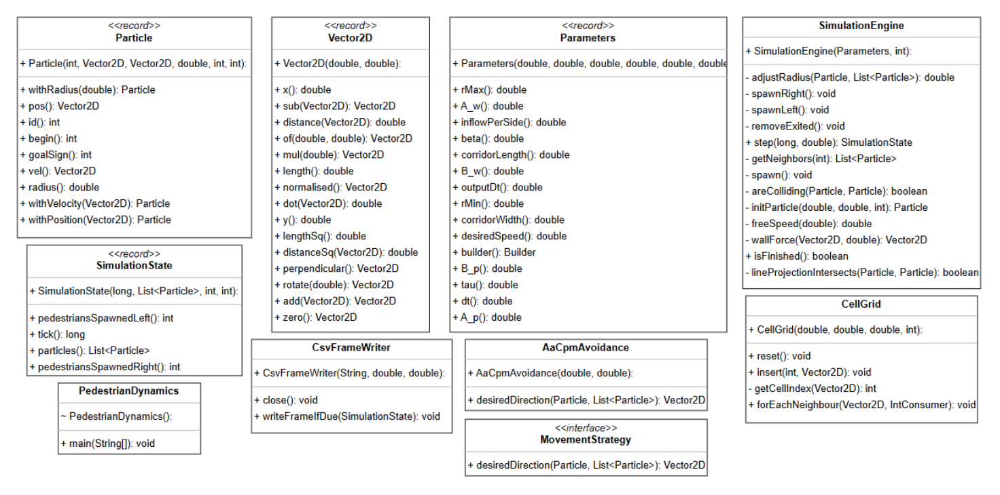

A high-performance bidirectional crowd simulation implementing the Anticipatory Collision Avoidance (ACA-CPM) algorithm with dynamic radius adjustment. The engine models realistic pedestrian flow through corridors using spatial cell-grid optimization and exponential repulsion forces to prevent collisions in counter-flow scenarios.

*Built for the Simulation Systems course at Buenos Aires Institute of Technology (ITBA).*

  

  

    
  

  

    
    
    
    
    
    
  

---

